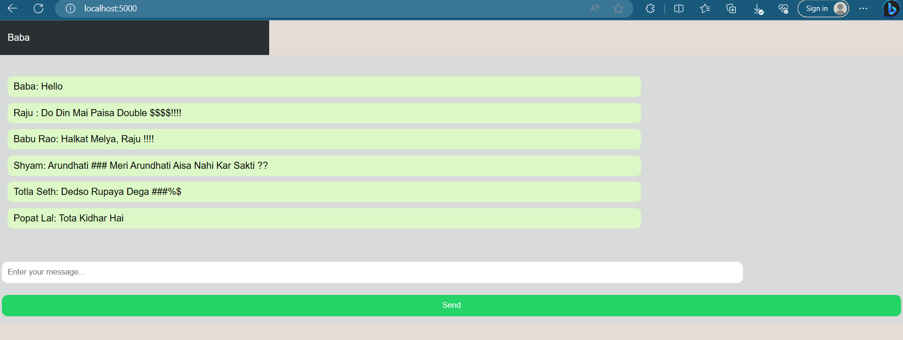

## Project Screenshot

Summary:
This code sets up a chat application similar to WhatsApp using Node.js and Socket.IO. It creates a server using Express and Socket.IO to facilitate real-time communication between clients. Users can send and receive chat messages within the application. The server listens on port 5000, and the chat messages are broadcasted to all connected clients

Description:
This project implements a real-time chat application similar to WhatsApp using Node.js and Socket.IO. The application allows users to engage in instant messaging, sending and receiving text messages in a chat-like interface. It's designed to demonstrate the power of real-time communication over the web.

Features:

Seamless real-time communication.
10s waiting or will close if no activity found before
User-friendly interface.
Messages are attributed to usernames.
Messages are instantly updated for all connected users.

Note:
This project is for educational purposes and serves as a foundation for building more complex real-time applications. Feel free to modify, expand, and customize it according to your requirements.